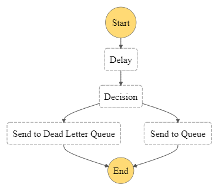

# delay_sqs_with_step_function
 
 SQS offers us the option to send messages with a maximum delay of 15 minutes.With this structure, we can send messages delayed more than 15 minutes.

The step function has got 2 endpoints on API GATEWAY. We can send to message its.

Sample : 

     POST : 
        request : /  
              body: {
                       "message":"test message",
                       "delay_seconds":"50",
                       "status:"SUCCESS"
                    }
        response : {
                     "executionId": "72c555d8-04b6-4c64-8f85-fc62b0d1cc47"
                   }
                   
    GET : 
        request : /{executionId}
        response : {
                     "status": "200"
                   }

Deploy : 

`$ aws cloudformation package --template-file template.yaml --s3-bucket aws-resources-dev-test --output-template-file packaged.yaml`

`$ aws cloudformation deploy --stack-name "step-function-example" --template-file packaged.yaml --capabilities CAPABILITY_IAM`

